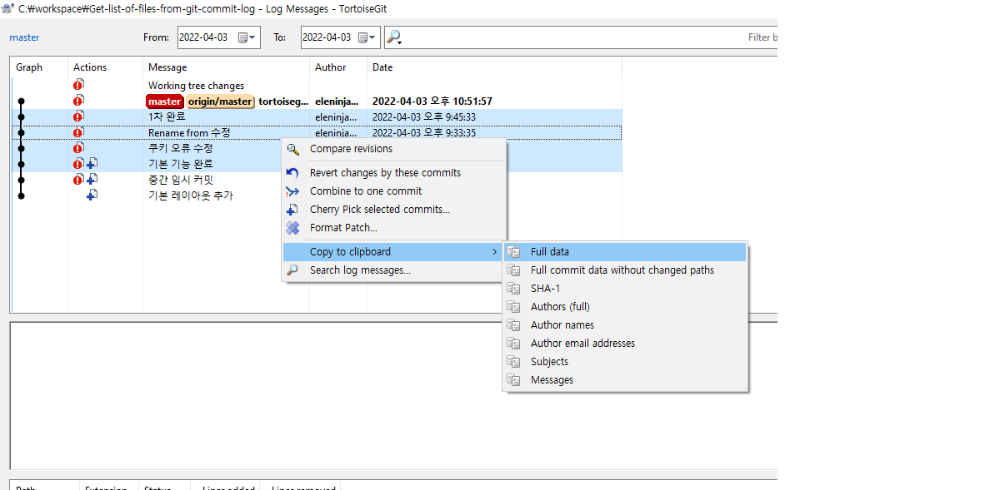
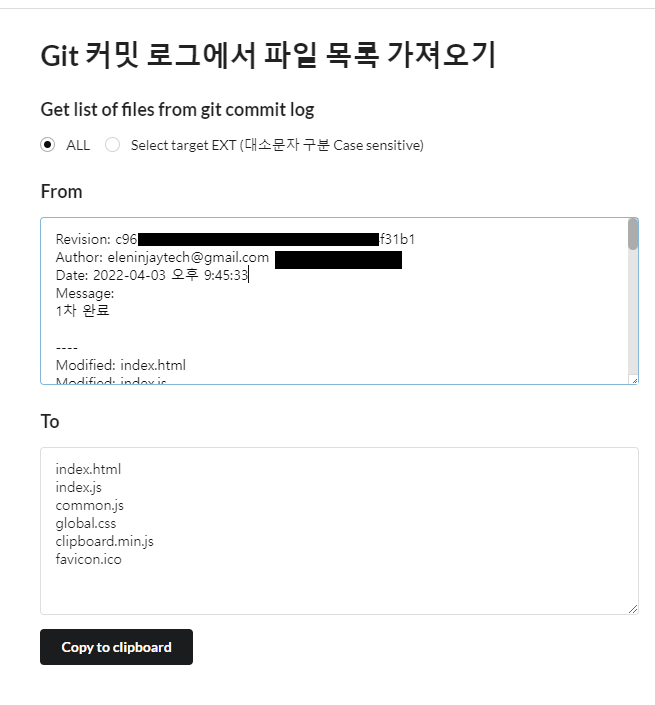
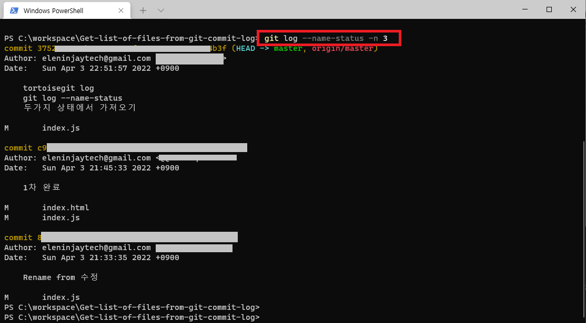
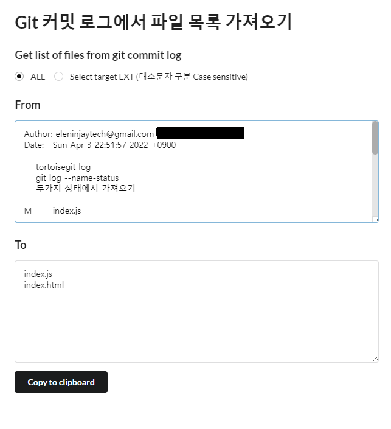

Git 로그 내용에서 파일 목록 가져오기 Get list of files from Git log content
=============

---------------------------------------

### Github page
[Go to Github page](https://eleninjaytech.github.io/Get-list-of-files-from-git-commit-log/)

### 목록
> TortoiseGit 로그에서 파일 목록 가져오기
> 
> Get list of files from TortoiseGit log

> CMD Git 로그에서 파일 목록 가져오기
> 
> Get list of files from Git Command log

---------------------------------------

### TortoiseGit 로그에서 파일 목록 가져오기
#### Get list of files from TortoiseGit log

    TortoiseGit > Show log

1. 로그 목록 에서 대상을 선택하고 로그를 복사한다 (full data copy)

2. From 영역에 내용을 추가한다

---------------------------------------

### CMD Git 로그에서 파일 목록 가져오기
#### Get list of files from Git Command log

    명령 프롬프트(PowerShell) > 프로젝트 폴더 > git log --name-status

1. 명령 프롬프트 에서 조회 후 대상을 선택하고 로그를 복사한다
   

2. From 영역에 내용을 추가한다
   